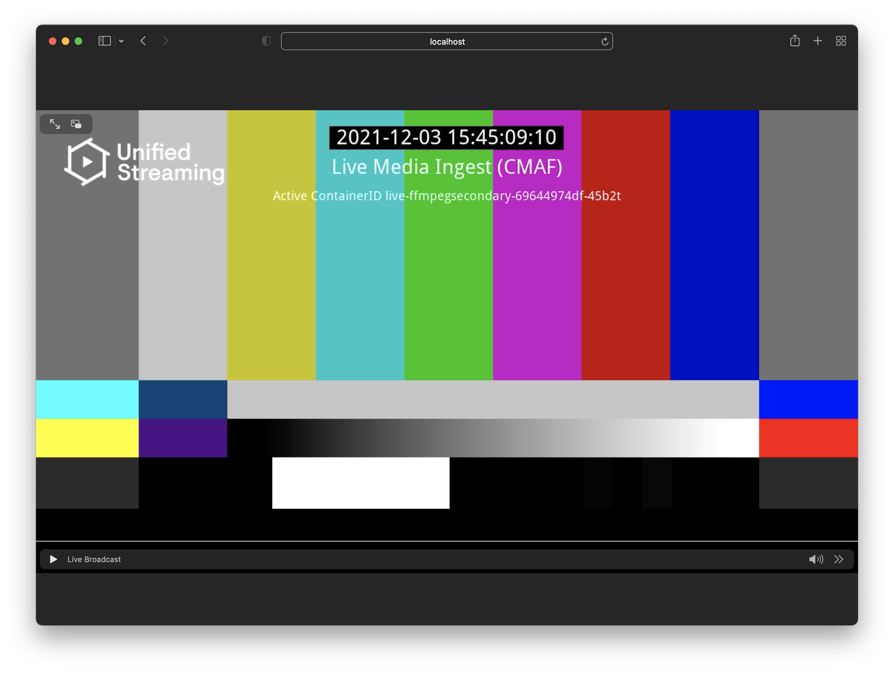

# remix-live2live-event
POC for delayed live2live event using Remix nPVR & VOD2Live to create a virtual
channel from a live source.

This requires a source Remix nPVR setup which archives a channel to an S3
bucket, a demo is available at
[unifiedstreaming/npvr](https://github.com/unifiedstreaming/npvr).


## Usage

The below assumes you are running the aforementioned nPVR demo, and archiving
our public SCTE35 live stream to the included Minio storage with bucket name
``npvr-demo`` and channel name ``scte35``.

```bash
# build the docker image
docker build -t remix-l2l-event docker

# Run event Origin
docker run -e UspLicenseKey -e REMOTE_STORAGE_URL=http://minio:9000 -e S3_REGION=default -e S3_ACCESS_KEY=minioadmin -e S3_SECRET_KEY=minioadmin -p 10000:80 --name remix-l2l-event --rm --network npvr_default remix-l2l-event

# Get shell in event Origin
docker exec -it remix-l2l-event sh

# Run event python script
python3 /app/event.py test_event --s3-bucket npvr-demo --archive-interval PT5M --archive-channel scte35 --s3-endpoint minio:9000
```

Now you should be able to play the test_event.isml stream in your browser or
player of choice:

* HLS: http://localhost:10000/test_event.isml/.m3u8
* DASH: http://localhost:10000/test_event.isml/.mpd




If your nPVR archive is using different configuration, make sure to set things
appropriately both in the environment variables of the Origin Docker container
and the arguments to the event script.

## Options
All arguments and options can be seen in the help:

```
python event.py --help
Usage: event.py [OPTIONS] NAME

Arguments:
  NAME  Name of mp4 and isml files to create  [required]

Options:
  --start-time [%Y-%m-%dT%H:%M:%S%z]
                                  Start time of the event, defaults to start
                                  of current hour.  [default: 2021-12-06
                                  15:00:00+00:00]
  --end-time [%Y-%m-%dT%H:%M:%S%z]
                                  End time of the event, defaults to one hour
                                  from now.  [default: 2021-12-06
                                  16:48:27.157531+00:00]
  --s3-endpoint TEXT              Endpoint for S3 compatible storage
                                  [default: localhost:9000]
  --s3-bucket TEXT                S3 bucket where archive is stored
                                  [required]
  --s3-access-key TEXT            S3 access key  [default: minioadmin]
  --s3-secret-key TEXT            S3 secret key  [default: minioadmin]
  --s3-region TEXT                S3 region  [default: default]
  --archive-interval TEXT         Interval used for archive chunks expressed
                                  as ISO 8601 duration  [required]
  --archive-channel TEXT          Archive channel name  [required]
  --delay INTEGER                 Delay behind 'live edge'.  [default: 600]
  --install-completion [bash|zsh|fish|powershell|pwsh]
                                  Install completion for the specified shell.
  --show-completion [bash|zsh|fish|powershell|pwsh]
                                  Show completion for the specified shell, to
                                  copy it or customize the installation.
  --help                          Show this message and exit.
```